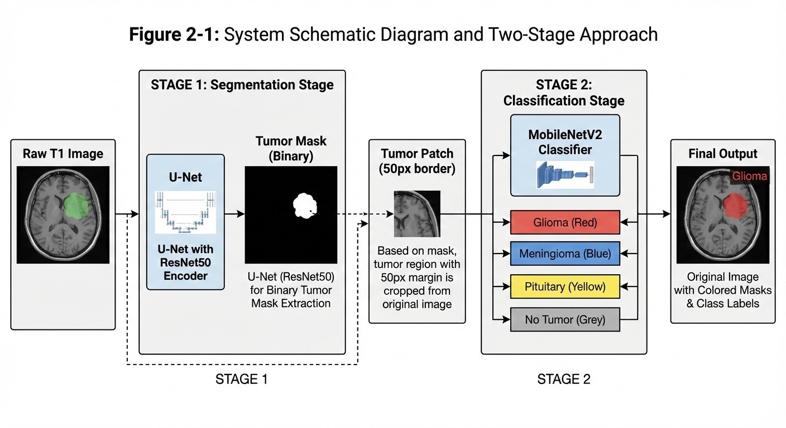
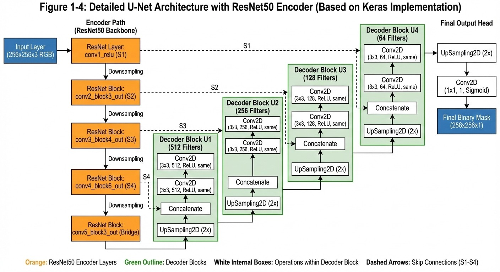
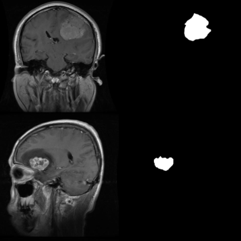
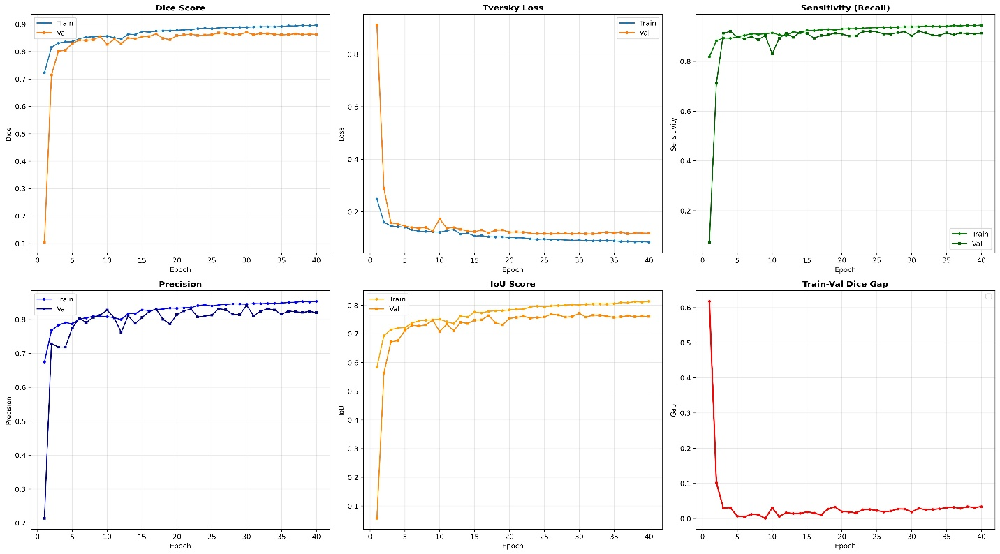
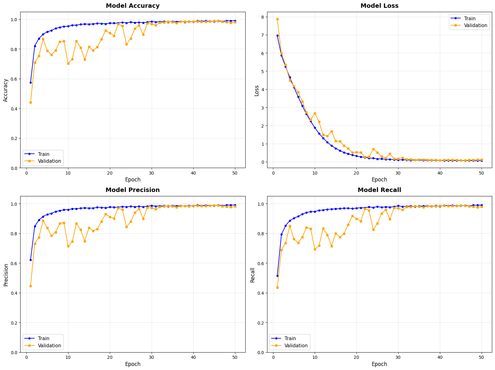
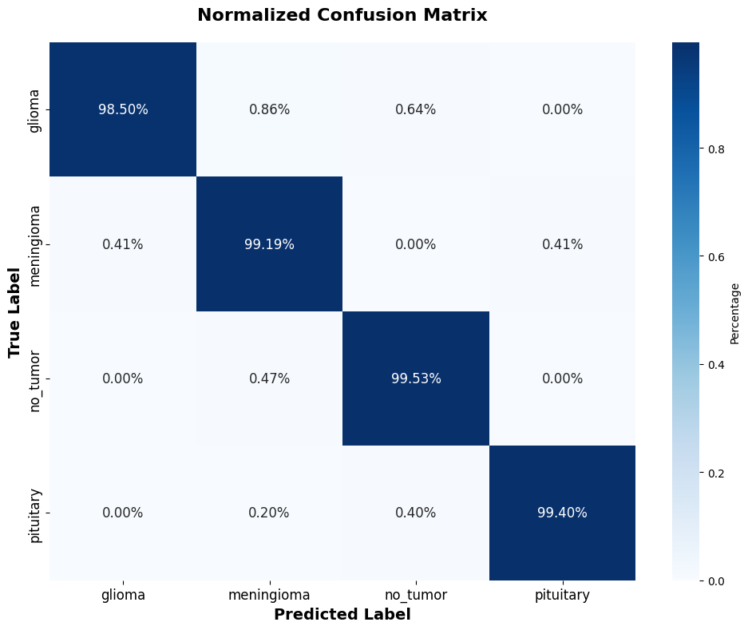
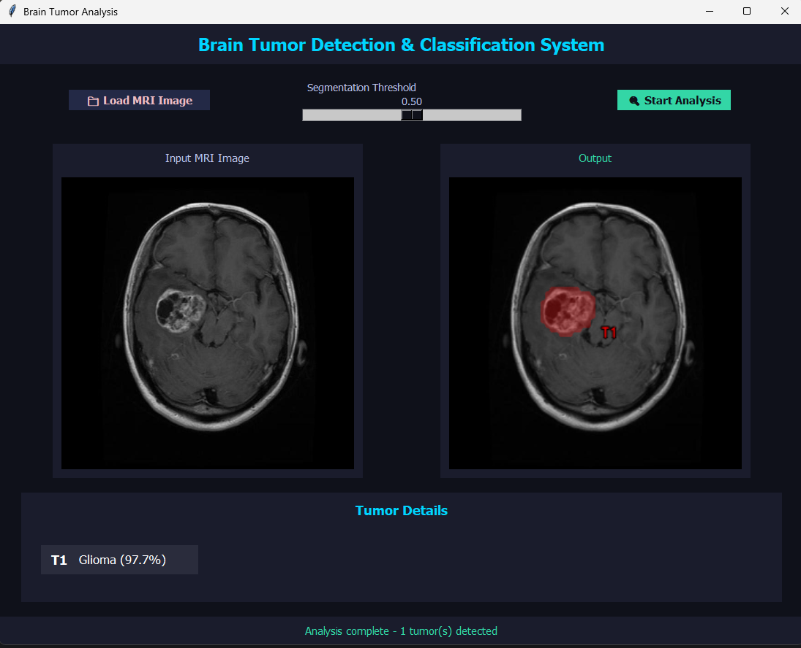

# Two-Stage Brain Tumor Segmentation and Classification from T1 MRI Images

A two-stage deep learning approach for brain tumor localization and classification from T1-weighted MRI images.

The project separates the task into two specialized stages:

1. **Tumor Segmentation** — a U-Net architecture with a pretrained ResNet50 encoder is used to segment tumor regions from healthy brain tissue.
2. **Tumor Classification** — segmented tumor regions are extracted as ROI patches and classified using a fine-tuned MobileNetV2 model.

The classification stage predicts four classes:

* Glioma
* Meningioma
* No-Tumor
* Pituitary

> **Medical / Research Disclaimer:** This project is intended for academic, research, and educational purposes. The reported results do not constitute clinical validation and this system must not be used as a substitute for professional medical diagnosis.

---

## Project Overview

The main idea of this project is to separate **tumor localization** from **tumor-type classification**.

Instead of directly classifying the entire MRI image, the system first identifies suspicious tumor regions using a segmentation model. These regions are then extracted from the original MRI, converted into ROI patches, and passed to a dedicated classification model.

This two-stage design allows the classifier to focus on the relevant tumor region and also supports independent processing of multiple detected tumor regions.

---

## System Pipeline



```text
                 T1 MRI Image
                      │
                      ▼
          U-Net + ResNet50 Encoder
                      │
                      ▼
               Tumor Segmentation
                      │
                      ▼
                Binary Tumor Mask
                      │
                      ▼
             Connected Components
                      │
                      ▼
          Bounding Box + 50 px Margin
                      │
                      ▼
               ROI / Tumor Patch
                   128 × 128
                      │
                      ▼
                MobileNetV2
                      │
                      ▼
             Classification Head
                      │
                      ▼
      ┌────────────┬──────────────┬────────────┬────────────┐
      │   Glioma   │  Meningioma  │  No-Tumor  │  Pituitary │
      └────────────┴──────────────┴────────────┴────────────┘
                      │
                      ▼
                 GUI Output
```

---

## Why a Two-Stage Approach?

The project uses a segmentation-first strategy instead of directly classifying the complete MRI image.

### Main advantages

* **ROI-focused classification:** the classifier focuses on tumor-related regions rather than the entire image.
* **Reduced irrelevant information:** large portions of healthy tissue and background are excluded from the classification input.
* **Multiple-tumor support:** independently detected regions can be processed separately.
* **Modular architecture:** segmentation and classification are implemented as separate components.
* **Flexible downstream usage:** the segmentation output can also be used independently for tumor-region analysis.

---

# Datasets

The project uses three dataset resources.

## 1. BRISC2025

Used as one of the sources for the segmentation image-mask pairs.

[BRISC2025 Dataset](DATASET_LINK_1)

## 2. Mixed Brain Tumor Dataset

Used together with BRISC2025 for the segmentation stage.

[Mixed Brain Tumor Dataset](DATASET_LINK_2)

## 3. Derived ROI Classification Dataset

A project-derived dataset used for the four-class classification stage.

[Derived Classification Dataset](DATASET_LINK_3)

> Replace `DATASET_LINK_1`, `DATASET_LINK_2`, and `DATASET_LINK_3` with the actual dataset URLs before publishing.

The segmentation dataset described in the project report contains approximately **11,000 image-mask pairs** assembled from the two segmentation sources.

---

# Project Structure

```text
brain-tumor-mri-two-stage/
│
├── README.md
├── requirements.txt
├── .gitignore
├── .gitattributes
│
├── assets/
│   ├── 01_pipeline.png
│   ├── 02_segmentation_architecture.png
│   ├── 03_segmentation_results.png
│   ├── 04_segmentation_training.png
│   ├── 05_classification_training.png
│   ├── 06_classification_confusion_matrix.png
│   └── 07_gui.png
│
├── notebooks/
│   ├── segmentation.ipynb
│   └── classification.ipynb
│
├── app/
│   └── gui.py
│
├── models/
│   ├── best_tumor_model.keras
│   └── best_tumor_classifier.keras
│
├── data/
│   └── README.md
│
└── results/
```

The notebooks are provided as **code-only Jupyter notebooks** and do not depend on saved execution outputs.

---

# Stage 1 — Tumor Segmentation

## Overview

The first stage performs binary segmentation of tumor regions in T1 MRI images.

The model receives a 256×256 three-channel representation of the MRI and produces a binary tumor mask.

The segmentation data is divided into:

| Split      | Ratio |
| ---------- | ----: |
| Training   |   70% |
| Validation |   15% |
| Test       |   15% |

---

## Architecture

The segmentation model is based on a **U-Net architecture with a pretrained ResNet50 encoder**.

Selected intermediate feature maps from ResNet50 are connected to the decoder using skip connections, allowing the decoder to recover spatial information while combining low-level and high-level features.


### Selected ResNet50 features

The implementation uses the following feature levels:

```text
conv1_relu
conv2_block3_out
conv3_block4_out
conv4_block6_out
conv5_block3_out
```

The deepest feature map acts as the bridge between encoder and decoder.

---

## Preprocessing

The segmentation pipeline performs:

* Resizing to **256×256**
* Pixel normalization to `[0, 1]`
* Conversion of grayscale MRI input into a 3-channel image
* Binary mask generation
* Random horizontal flipping
* Random vertical flipping

The implementation uses a custom `DataGenerator` based on Keras `Sequence`.

---

## Loss Function

Because tumor pixels occupy a relatively small part of the image, the project uses **Tversky Loss** to address foreground/background imbalance.

The reported configuration is:

```text
alpha = 0.3
beta  = 0.7
```

This gives higher weight to false-negative errors.

---

## Training Configuration

| Parameter         | Value                             |
| ----------------- | --------------------------------- |
| Input Size        | 256×256×3                         |
| Optimizer         | Adam                              |
| Learning Rate     | 0.0001                            |
| Batch Size        | 16                                |
| Maximum Epochs    | 40                                |
| Early Stopping    | Yes                               |
| ReduceLROnPlateau | Yes                               |
| Loss              | Tversky Loss                      |
| Metrics           | Dice, Sensitivity, Precision, IoU |

The model contains approximately **43.9 million parameters** according to the project report.

---

## Segmentation Results

The reported best segmentation results are:

| Metric               |     Result |
| -------------------- | ---------: |
| Dice                 | **87.45%** |
| Sensitivity / Recall | **91.57%** |
| Precision            | **83.97%** |
| IoU                  | **77.96%** |
| Test Tversky Loss    | **0.1099** |

The best model was reported at **epoch 16**.



### Training Curves



---

# Stage 2 — Tumor Type Classification

## Overview

The second stage classifies the tumor regions identified by Stage 1.

Instead of sending the complete MRI image to the classifier, the system extracts detected tumor regions and converts them into individual ROI patches.

---

## ROI / Patch Generation

For each detected tumor component:

1. A bounding box is calculated.
2. A **50-pixel margin** is added around the bounding box.
3. The corresponding region is cropped from the original MRI.
4. The crop is resized to **128×128**.
5. Pixel values are normalized.
6. The resulting patch is passed to the classifier.

When multiple tumor regions are detected, each region is processed independently.

---

## Classification Classes

```text
Glioma
Meningioma
No-Tumor
Pituitary
```

---

## MobileNetV2 Architecture

The classifier uses **MobileNetV2** with ImageNet pretrained initialization.

The original ImageNet classification head is replaced with a custom four-class head.

```text
MobileNetV2
      │
      ▼
GlobalAveragePooling2D
      │
      ▼
BatchNormalization
      │
      ▼
Dropout(0.5)
      │
      ▼
Dense(256, ReLU, L2)
      │
      ▼
BatchNormalization
      │
      ▼
Dropout(0.4)
      │
      ▼
Dense(128, ReLU, L2)
      │
      ▼
Dropout(0.3)
      │
      ▼
Dense(4, Softmax)
```

The complete MobileNetV2 backbone is fine-tuned during training.

---

## Data Augmentation

The classification training pipeline uses:

* Rotation
* Width shifting
* Height shifting
* Shearing
* Zoom
* Horizontal flipping
* Vertical flipping
* Brightness variation
* Pixel rescaling

Class weighting is also used to compensate for class imbalance.

---

## Training Configuration

| Parameter         | Value                    |
| ----------------- | ------------------------ |
| Input Size        | 128×128×3                |
| Optimizer         | Adam                     |
| Learning Rate     | 0.0001                   |
| Batch Size        | 32                       |
| Maximum Epochs    | 50                       |
| Early Stopping    | Yes                      |
| ReduceLROnPlateau | Yes                      |
| Loss              | Categorical Crossentropy |
| Class Weighting   | Balanced                 |

The classifier contains approximately **2.6 million parameters** according to the project report.

---

## Classification Results

| Metric                   |     Result |
| ------------------------ | ---------: |
| Best Validation Accuracy | **98.81%** |
| Test Accuracy            | **99.10%** |
| Test Precision           | **99.11%** |
| Test Recall              | **99.10%** |
| Test F1-Score            | **99.11%** |

### Training Curves



### Confusion Matrix



---

# Model Selection

During development, an initial classification experiment was performed using **EfficientNet**.

On the available MRI ROI dataset, the experiment showed rapid overfitting and validation accuracy remained around **30%**.

Based on the observed behavior, MobileNetV2 was selected as a lighter architecture better suited to the available dataset and the 128×128 ROI input.

---

# Graphical User Interface

The project includes a desktop GUI implemented using **Tkinter**.

The application allows the user to:

1. Load an MRI image.
2. Adjust the segmentation threshold.
3. Run the segmentation model.
4. Detect tumor regions.
5. Extract a 50-pixel-margin ROI around each region.
6. Classify each detected region.
7. Display the tumor class and confidence.
8. Visualize detected tumor regions on the MRI.

The application also applies post-processing to the segmentation output using Gaussian smoothing, thresholding, and morphological closing before extracting contours.



---

# Model Files

The project uses two trained models:

```text
models/
├── best_tumor_model.keras
└── best_tumor_classifier.keras
```

### Segmentation Model

```text
best_tumor_model.keras
```

This is the trained U-Net + ResNet50 segmentation model used by the GUI.

### Classification Model

```text
best_tumor_classifier.keras
```

This is the trained MobileNetV2-based classification model.

The `.keras` files should be managed using **Git LFS**, especially the approximately 500 MB segmentation model.

---

# Installation

Install the required Python packages:

```bash
pip install -r requirements.txt
```

Recommended `requirements.txt`:

```text
tensorflow
numpy
matplotlib
seaborn
scikit-learn
opencv-python
Pillow
```

---

# Running the Project

## 1. Clone the Repository

```bash
git clone YOUR_GITHUB_REPOSITORY_URL
cd brain-tumor-mri-two-stage
```

## 2. Install Dependencies

```bash
pip install -r requirements.txt
```

## 3. Download / Place the Model Files

Place the two trained models inside:

```text
models/
├── best_tumor_model.keras
└── best_tumor_classifier.keras
```

## 4. Run the GUI

From the project root:

```bash
python app/gui.py
```

The application automatically looks for the models inside the repository's `models/` directory.

---

# Git LFS

Because the segmentation model is approximately 500 MB, the model files should be tracked using Git LFS.

Initialize Git LFS:

```bash
git lfs install
```

Track the model files:

```bash
git lfs track "models/*.keras"
```

Then:

```bash
git add .gitattributes
git add models/
git commit -m "Add pretrained model weights"
git push
```

Do not upload the 500 MB model through the normal GitHub web uploader.

---

# Notebook Files

The repository contains two source-code notebooks:

### Segmentation

[Open Segmentation Notebook](notebooks/segmentation.ipynb)

Contains the complete Stage 1 code for:

* Dataset preparation
* Image-mask pairing
* Train/validation/test splitting
* Data generation
* U-Net + ResNet50 construction
* Tversky Loss
* Model training
* Evaluation
* Training visualization
* Model saving

### Classification

[Open Classification Notebook](notebooks/classification.ipynb)

Contains the complete Stage 2 code for:

* Dataset splitting
* Image augmentation
* Class weighting
* MobileNetV2 construction
* Model training
* Classification report
* Training curves
* Confusion matrix
* Final model saving

The notebooks are intentionally provided as **code-only notebooks**.

---

# Project Results

## Segmentation

```text
Dice         : 87.45%
Sensitivity  : 91.57%
Precision    : 83.97%
IoU          : 77.96%
```

## Classification

```text
Validation Accuracy : 98.81%
Test Accuracy       : 99.10%
Precision           : 99.11%
Recall              : 99.10%
F1-Score            : 99.11%
```

---

# Technologies

| Category             | Technology         |
| -------------------- | ------------------ |
| Programming Language | Python             |
| Deep Learning        | TensorFlow / Keras |
| Segmentation         | U-Net + ResNet50   |
| Classification       | MobileNetV2        |
| Image Processing     | OpenCV             |
| Numerical Computing  | NumPy              |
| Visualization        | Matplotlib         |
| Metrics / Utilities  | Scikit-learn       |
| GUI                  | Tkinter            |
| Image GUI Handling   | Pillow             |
| Training Platform    | Kaggle             |
| GPU                  | NVIDIA Tesla P100  |

The reported development environment used Kaggle Notebook with an NVIDIA Tesla P100 GPU.

---

# Limitations

The project has several limitations:

* Only **T1 MRI** images were used.
* The segmentation dataset, although approximately 11,000 image-mask pairs, remains limited compared with very large medical imaging datasets.
* The classification stage depends on the quality of the segmentation output.
* Evaluation was performed using internal train/validation/test splits.
* No external validation on an independent hospital or clinical dataset was performed.

---

# Future Work

Potential future directions include:

* Combining multiple MRI modalities such as T1, T2, FLAIR, and contrast-enhanced T1.
* Investigating more advanced segmentation architectures.
* Performing external validation on independent datasets.
* Improving deployment and inference workflows.

The project report specifically suggests investigating architectures such as attention-based U-Net variants, DeepLabV3+, and Transformer-based approaches, as well as external validation.

---

# Dataset and Model Links

## Datasets

* [BRISC2025](DATASET_LINK_1)
* [Mixed Brain Tumor Dataset](DATASET_LINK_2)
* [Derived ROI Classification Dataset](DATASET_LINK_3)

## Trained Models

* [Segmentation Model](MODEL_LINK_1)
* [Classification Model](MODEL_LINK_2)

> Replace all placeholder links with the actual URLs before publishing.

---

# References

1. **A classification of MRI brain tumor based on two stage feature level ensemble of deep CNN models.**
   *Computers in Biology and Medicine*, 2022.
   DOI: https://doi.org/10.1016/j.compbiomed.2022.105539

2. **Multi-class brain tumor MRI segmentation and classification using deep learning and machine learning approaches.**
   *Cancer Imaging / Springer Nature*, 2025.
   DOI: https://doi.org/10.1186/s40644-025-00953-2

3. **Brain tumor segmentation and classification using MRI: Modified SegNet model and hybrid deep learning architecture with improved texture features.**
   *Computational Biology and Chemistry*, 2025.
   DOI: https://doi.org/10.1016/j.compbiolchem.2025.108381

4. **Deep learning-driven brain tumor classification and segmentation using non-contrast MRI.**
   *Scientific Reports*, 2025.
   DOI: https://doi.org/10.1038/s41598-025-13591-2

---

# Author

**Mehran Bahrami**

Academic Project — Computer Engineering, Deep Learning & Computer Vision
